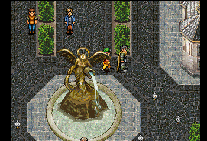

## Greminster Birds
These differ from normal NPCs in that they're not in the room data structure.

There is a pointer at `0x80199f7c` that points to the address of the first bird.
There are 5 birds, represented by a structure 16 bytes long:

### Structure
- 0x0: X Initial Position
- 0x1: Y Initial Position
- 0x2: X Current Position
- 0x3: Y Current Position
- 0x4: Movement on X plane. 0 = not moving, positive number is moving right, negative number is moving left. Number moves towards 0.
- 0x5: Movement on Y plane. 0 = not moving, positive number is moving ?, negative number is moving ?. Number moves towards 0.
- 0x6: Seems to always = 1
- 0x7 - 0x9: Seem to always = 0
- 0xA, 0xB: Seen them equal 0x12 or 0x0, always matching.
- 0xC: Pointer

### Starting Positions
1. X = 0x74, Y = 0x30
2. X = 0x79, Y = 0x35
3. X = 0x71, Y = 0x39
4. X = 0x50, Y = 0x33
5. X = 0x57, Y = 0x36

